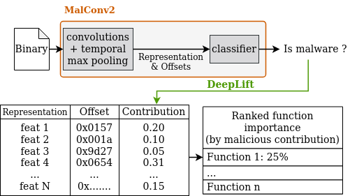

<br>
<em>Background image generated with "Le Chat" - Mistral AI</em>

## Table of Contents

- [Overview](#overview)
- [Technologies and Methods](#used-technologies-and-method)
- [Dataset](#dataset)
- [Features](#features)
- [Installation](#installation)
- [Usage](#usage)
- [Code Structure](#code-structure)
- [License](#license)
- [Acknowledgments](#acknowledgments)

## Overview

This repository contains the code and resources accompanying the paper **"From Black Box to Clear Insights: Explainable AI in Malware Detection with MalConv2"**.
The study focuses on enhancing the transparency of AI models in cybersecurity, specifically through the application of Explainable AI (XAI)
techniques to the MalConv2 model for malware detection. Our work allows us to successfully identify a subset of functions related to malicious behavior.

## Used Technologies and method

The primary technologies and method used in this project include:

- **[MalConv2](https://github.com/FutureComputing4AI/MalConv2)**: A convolutional neural network (CNN) architecture optimized for malware detection.
- **[DeepLIFT](https://github.com/kundajelab/deeplift)**: A method for interpreting neural network predictions by backpropagating the contributions of each input feature.

A simplified representation of our explainability process is presented hereafter:



## Dataset

The MalConv2 model was trained on a balanced dataset consisting of 179.278 binaries, including both malware and goodware.
The dataset is a mix of Windows and Linux executables, sourced from various repositories, including VX-Underground.
Only SHA256 are released due to license issues, the associated metadata (i.e. SHA256, binary type, etc.) are stored in `metas` directory.

## Features

Our repository and code allows you to:
- train and validate a `malconv2` model on binary executable part
- use XAI methods on this model and compare various methods

You can reuse our comparison methods and adapt it to your use case, it can be applied to multiple machine learning models.

## Installation

```bash
git clone <https_repo_url>
cd xai_malware
python3.11 -m venv venv_xai_malware
source venv_xai_malware/bin/activate
pip install requirements.txt
```

## Usage

### Dataset creation

To create your torch database and datasets from binaries:

```python
from malconv.dataset import Malconv2RawBytes
extract = Malconv2RawBytes(sha256_list, targets, input_dir, output_path)
extract.run()
```

To create your post-conv dataset *(use to compare XAI methods)*:

```python
from malconv.dataset import get_post_conv_dataset
post_conv_dataset = get_post_conv_dataset(
    original_set_path="your_original_dataframe_with_user_hash_and_targets",
    model_path="your_trained_model_path",
    torch_db_path="your_torch_database_path"
)
```

### Training

The following call, allow you to train a `malconv2` model:

```bash
python training.py --batch-size 32
```

_Note: `malconv` directory contains the code associated to the model architecture. The directory contains code from the [Malconv2](https://github.com/FutureComputing4AI/MalConv2) official repository, with small modifications in order to allow the explainability proccess._

### Validation

To validate your trained model with python objects:

```python
from validation import Malconv2Validation
validation = Malconv2Validation(
    model_path, "your_validation_parquet_file", "your_torch_database_path", device="cpu / cuda", batch_size=1
)
validation.evaluate()
```
or with our script:

```bash
python validation.py --model-path your_model_path --ds-valid-path your_validation_parquet_file \
--malconv-db-path your_torch_database_path --device cuda --batch-size 1
```

_Note: The trained model used in the publication is released under `models` directory._

### XAI methods comparison

To compare XAI methods with `malconv2` model:

```bash
python compare_methods.py --train-set-path your_post_conv_train_dataset.parquet \
--test-set-path your_post_conv_test_dataset.parquet \
--model-path your_model_path \
--output-path your_output_dir
```

_Note: The implementation of the methods and metrics used can be found in `methods` and `metrics` directories_


## License

This project is licensed under the MIT License - see the LICENSE file for details.

## Acknowledgments

We would like to thank the GLIMPS AI team for their support and contribution to this research.

